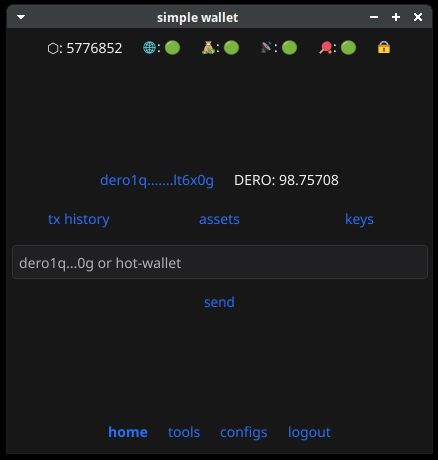
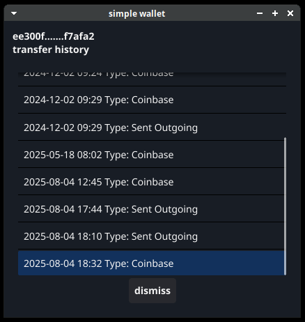
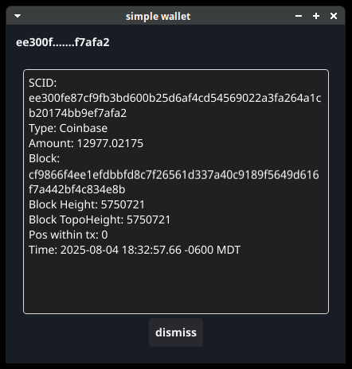
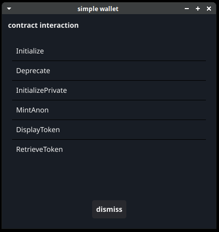
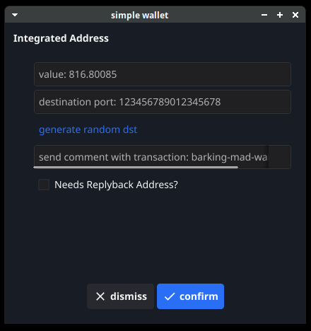
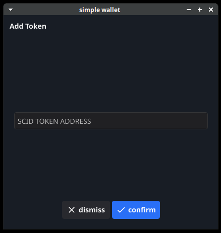
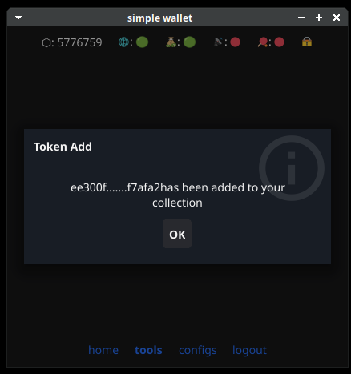
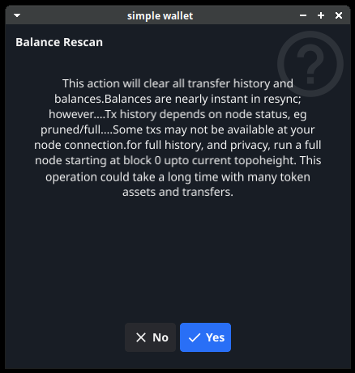

# simple-wallet

This is a simple Dero wallet built using Fyne.

**This software is alpha stage software, use only for testing and evaluation purposes.**

## Caveats

This program uses the following derohe version: 

`{"Version": "3.5.3-140.DEROHE.STARGATE+13062023"}`

It has been demonstrated to contain a re-use of randomness vulnerability affecting transaction data privacy that makes it possible to decrypt transaction data. **As such, there are no claims of privacy or security with this program. It is intended for testing and evaluation purposes only.**

# Why I made simple-wallet 

I woke up one day with the distinct impression I wanted a wallet that was simple, yet feature-full. 

The core focus was to bring a few underlying Dero tools to the surface: 
- file signing/verification
- self/recipient encryption/decryption
- integrated address generation 

Initial feedback suggested a contract installer/interactor would be useful, and a Pong server would be a fun addition — historically speaking, I enjoy Pong servers. :)

# Features
- Easy to read topbar: 
    - "BLOCK" Block Beight 
    - "NODE" Node Connection 
    - "WALLET" Wallet Logged-In 
    - "RPC" RPC Server 
    - "lockscreen" Lockscreen Button
- Create/Login/Restore Wallets
- Transaction History
- Asset Collections with Histories
- Seed Phrase & Public/Secret Key Reveal
- Sending with Options, including Token Assets
- Public Node Auto-Connect
- RPC Server
- Dero Tools:
    - File Signing/Verification
    - Integrated Address Generation
    - Self-Encryption/Decryption
    - Recipient Encryption/Decryption
    - Token Adding
    - Balance Rescan
    - Contract Installer
    - Contract Interactor

# Installation

You will need Go, and a newer version is recommended. Fyne has its own set of dependencies: [https://docs.fyne.io/started/](https://docs.fyne.io/started/)

If you have handled dependencies and have a properly configured Go environment, you can install `simple-wallet`.

If you would like to build from source:
```sh
git clone https://github.com/secretnamebasis/simple-wallet
cd simple-wallet
go build .
./simple-wallet
```

Or you can simply run the program:
```sh
git clone https://github.com/secretnamebasis/simple-wallet
cd simple-wallet
go run .
```

# Development

The basic design pattern for this application has been:

- Define a program hyperlink.
- Construct a dialog for content to display.
- Make the hyperlink's OnTapped function display the dialog.
- Load a container with hyperlinks.

Some other developments that could be useful:
- Expand the public node list
- Mobile application for android devices
- Multiple desktop environments, there have been zero tests in Microsoft, Android or MacOS environments — strongly doubt iOS app would ever happen.

There are many additional Dero-related technologies that could be integrated into this program:

- Native Explorer, Miner, Daemon
- Civilware Integrations:
  - ENCRYPTED_DEFAULT_PAYLOAD_CBOR_V2
  - Gnomon integration (likely via an RPC/WS connection, versus within the program)
  - XSWD Websocket
  - Tela Installer & Server
  - Epoch Management

# Image Gallery 
| |  |  |
|---|---|---|
|   |   |   |
|   |   |   |
|   |   |   |
|   |   |   |
|   |   |   |
|   |   |   |
|   |   |   |
|   |   |   |
|   |   |   |
|   |   |  |   |
|   |   |   |

# Contributing
There's really only one rule for contributing to projects I maintain: have fun learning! Anyone is welcome to contribute as much as they'd like, or they can fork the project at any time to create their own version of simple-wallet.

# License
You are welcome to do whatever you want with this code, as long as you first respect the RESEARCH LICENSE of Derohe (restrictive) and then observe the BSD 3-Clause license of Fyne (permissive). Please see LICENSE for more details. But the most important thing to remember:

TECHNOLOGY IS PROVIDED "AS IS", WITHOUT WARRANTIES OF ANY KIND, EITHER EXPRESS OR IMPLIED INCLUDING, WITHOUT LIMITATION, WARRANTIES THAT ANY SUCH TECHNOLOGY IS FREE OF DEFECTS, MERCHANTABLE, FIT FOR A PARTICULAR PURPOSE, OR NON-INFRINGING OF THIRD PARTY RIGHTS. YOU AGREE THAT YOU BEAR THE ENTIRE RISK IN CONNECTION WITH YOUR USE AND DISTRIBUTION OF ANY AND ALL TECHNOLOGY UNDER THIS LICENSE.
