# simple-wallet

This is a simple Dero wallet built using Fyne.

**This software is alpha stage software, use only for testing and evaluation purposes.**

# Features
- Easy-to-read topbar: 
    - "BLOCK" - Block Beight 
    - "NODE" - Node Connection 
    - "WALLET" - Wallet Logged-In 
    - "WS" - WS Server 
    - "RPC" - RPC Server 
- "🔒" Lockscreen Button
- Create/Login/Restore Wallets
- Transaction History
- Asset Collections with Histories
- Seed Phrase & Public/Secret Key Reveal
- Sending with Options, including Token Assets
- Public Node Auto-Connect
- Simulator Launcher
- RPC Server
- Integrated Address Generation
- Token Adding
- Asset Scanner - via Gnomon Smart Contact
- Balance Rescaning
- New Entry Notification Settings
- Dero Tools:
  - ENCRYPTION TOOLS
    - File Signing/Verification
    - Self-Encryption/Decryption
    - Recipient Encryption/Decryption
  - EXPLORE BLOCKCHAIN
    - Nifty Difficulty Graph
  - SMART CONTRACTS
    - Contract Installer
    - Contract Interactor

# Installation

You will need Go, and a newer version is recommended. Fyne has its own set of dependencies: [https://docs.fyne.io/started/](https://docs.fyne.io/started/)

Be sure to check out the [releases](https://github.com/secretnamebasis/simple-wallet/releases) for linux and windows binaries; maybe one day I will be able to afford a mac...  

If you would like to build from source:
```sh
git clone https://github.com/secretnamebasis/simple-wallet
cd simple-wallet
go build .
./simple-wallet
```

Or you can simply run the program:
```sh
git clone https://github.com/secretnamebasis/simple-wallet
cd simple-wallet
go run .
```

Or, assuming you have a properly configured `go` environment:
```sh
go install github.com/secretnamebasis/simple-wallet@latest
simple-wallet
```

# Development

Most of the dev process has been to imbue a GUI with as much of the present wallet client tools as possible, while also introducing some components that make it easier to dev on the DERO blockchain.   

Some other developments that could be useful:
- Expand the public node list
- Multiple desktop environments, there have been zero tests in Microsoft or MacOS environments — strongly doubt iOS app would ever happen.

There are many additional Dero-related technologies that could be integrated into this program:

- Native DERO tools
  - ~~Explorer~~
  - ~~Simulator~~
  - Miner
  - Daemon
- Civilware Integrations:
  - ~~ENCRYPTED_DEFAULT_PAYLOAD_CBOR_V2~~
  - ~~Gnomon integration~~ 
  - ~~XSWD Websocket~~
  - Tela Installer & Server
  - Epoch Management

# Image Gallery

| | | |
|---|---|---|
|  | 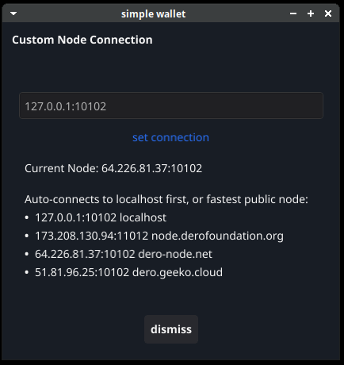 | 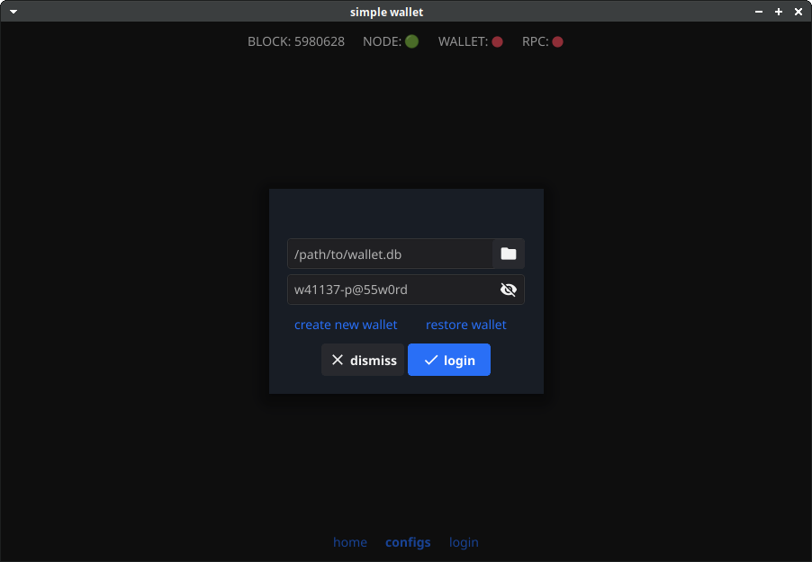 |
| 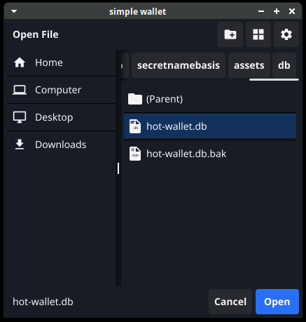 | 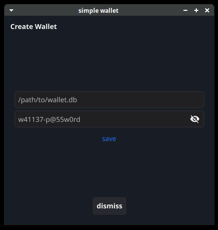 | 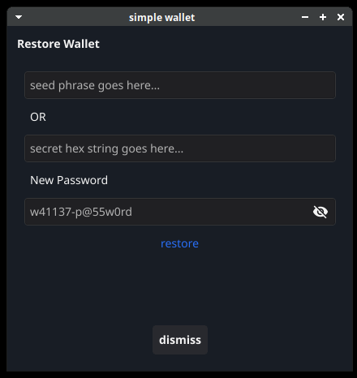 |
| 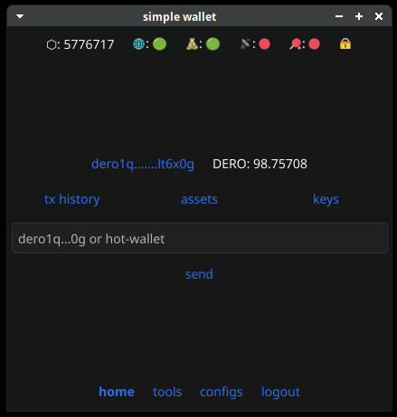 |  | 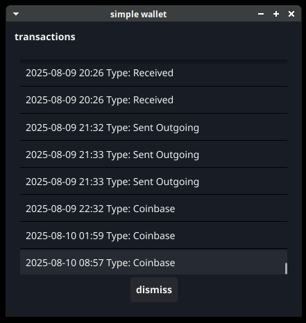 |
| 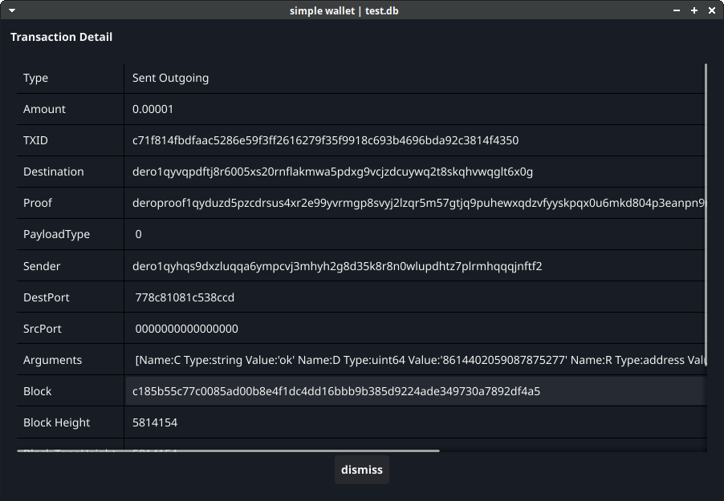 | 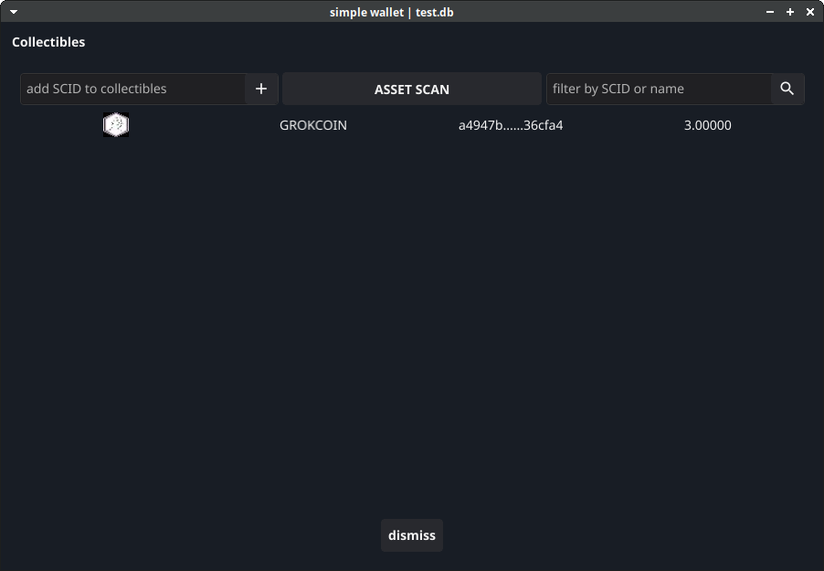 | 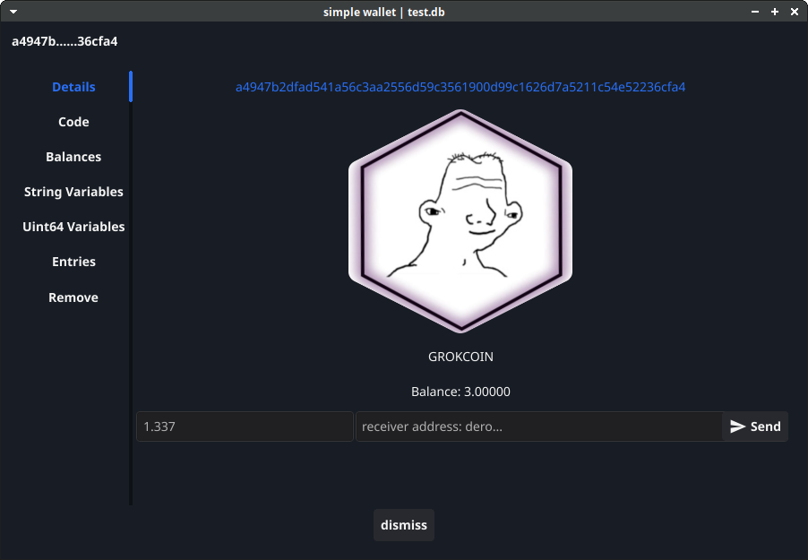 |
| 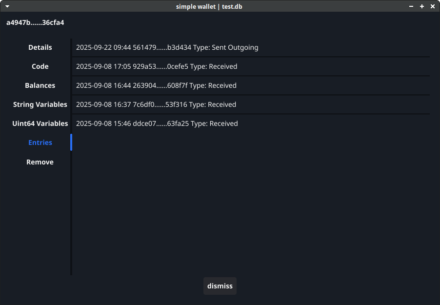 | 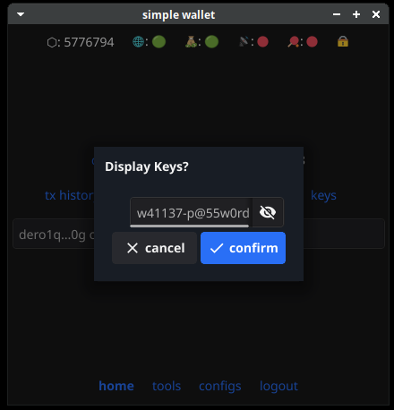 | 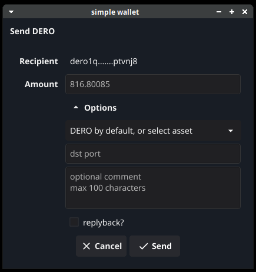 |
| 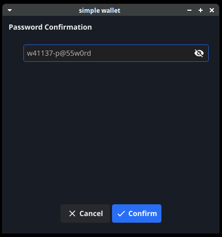 | 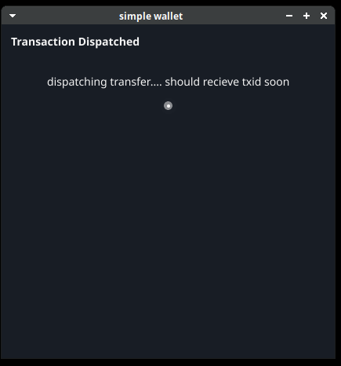 | 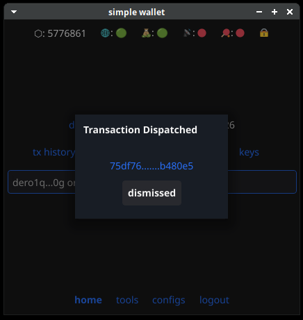 |
| 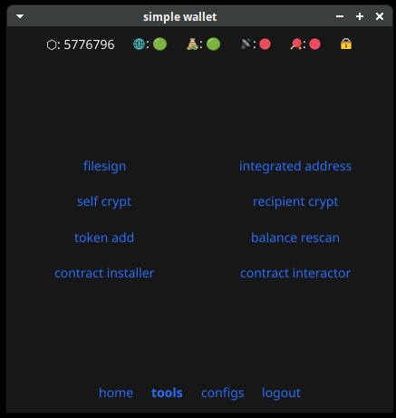 | 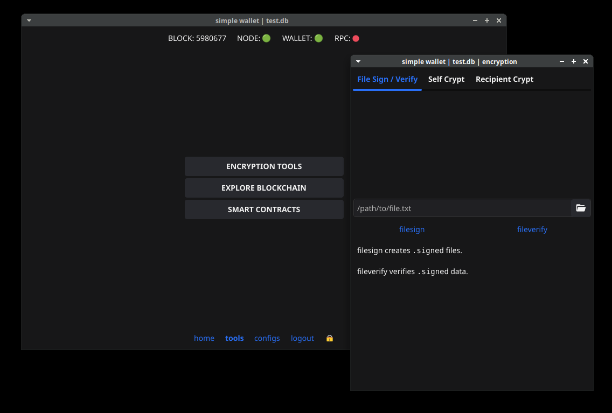 | 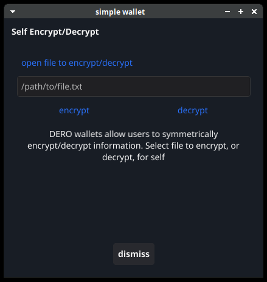 |
| 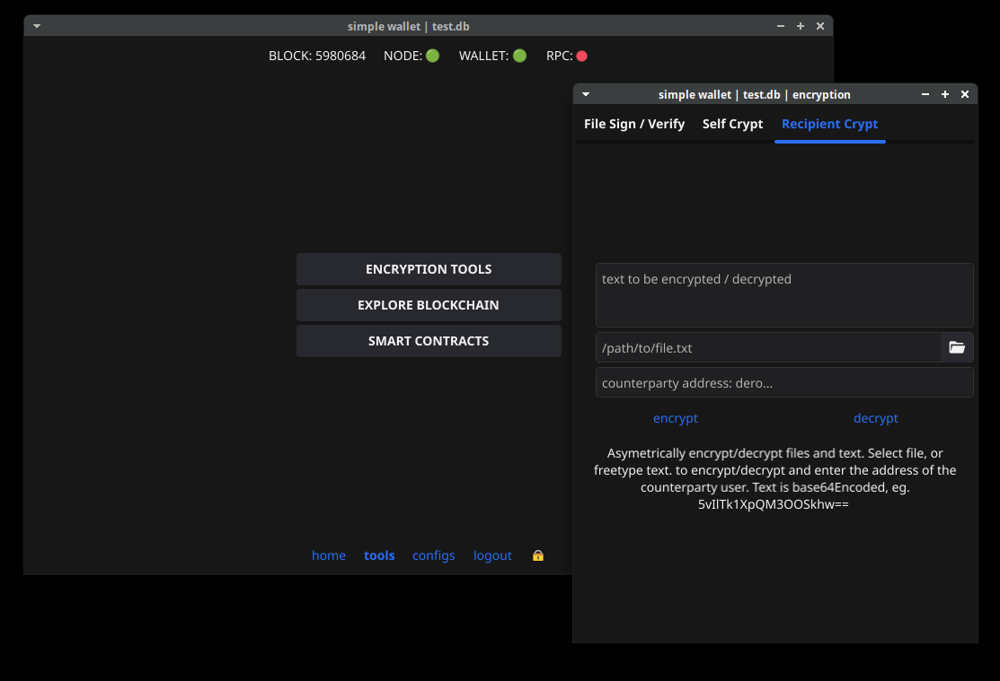 | 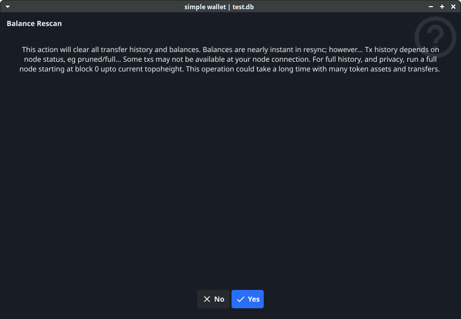 | 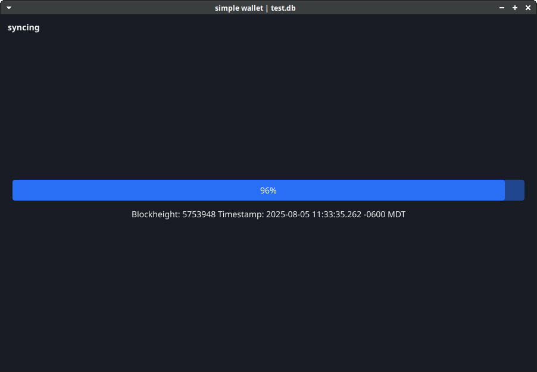 |
| 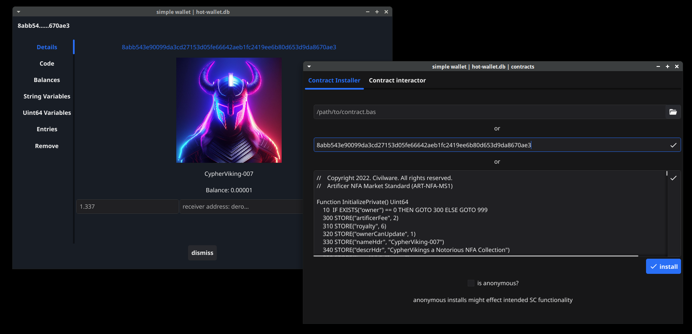 | 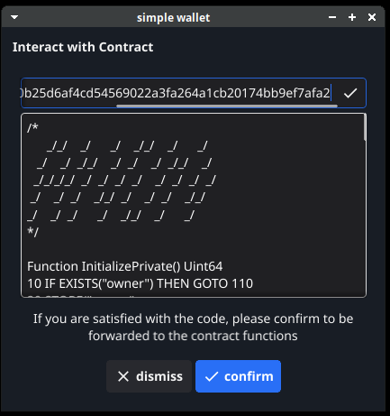 | 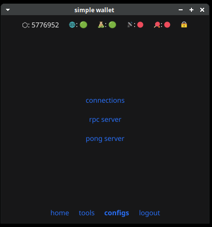 |
|  | 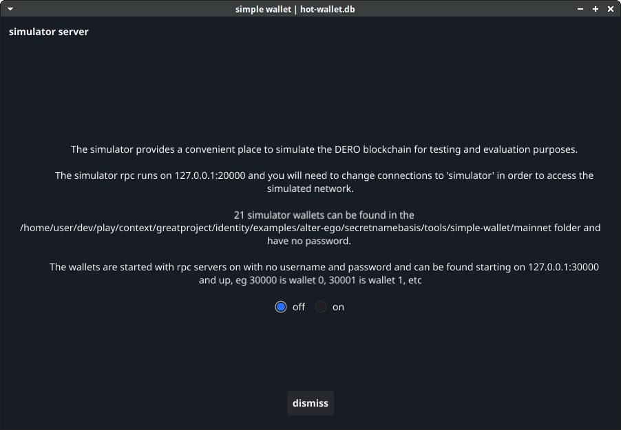 | 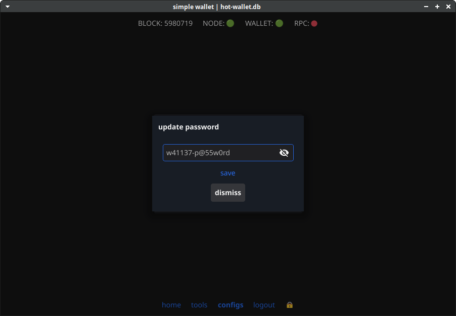 |
| 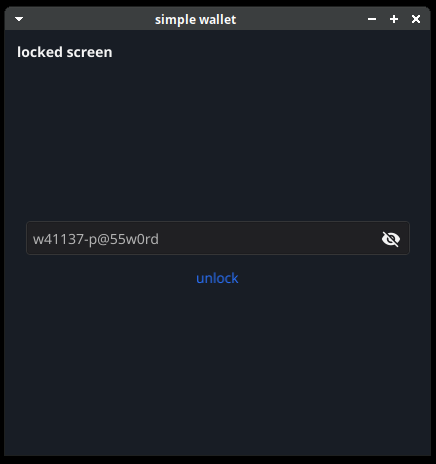 | | |


# Contributing
There's really only one rule for contributing to projects I maintain: have fun learning! Anyone is welcome to contribute as much as they'd like, or they can fork the project at any time to create their own version of simple-wallet.

# License
You are welcome to do whatever you want with this code, as long as you first respect the RESEARCH LICENSE of Derohe (restrictive) and then observe the BSD 3-Clause license of Fyne (permissive). Please see LICENSE for more details. But the most important thing to remember:

TECHNOLOGY IS PROVIDED "AS IS", WITHOUT WARRANTIES OF ANY KIND, EITHER EXPRESS OR IMPLIED INCLUDING, WITHOUT LIMITATION, WARRANTIES THAT ANY SUCH TECHNOLOGY IS FREE OF DEFECTS, MERCHANTABLE, FIT FOR A PARTICULAR PURPOSE, OR NON-INFRINGING OF THIRD PARTY RIGHTS. YOU AGREE THAT YOU BEAR THE ENTIRE RISK IN CONNECTION WITH YOUR USE AND DISTRIBUTION OF ANY AND ALL TECHNOLOGY UNDER THIS LICENSE.
